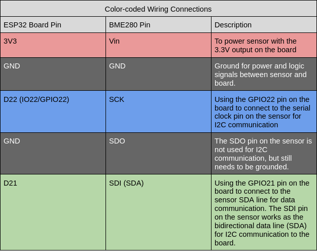
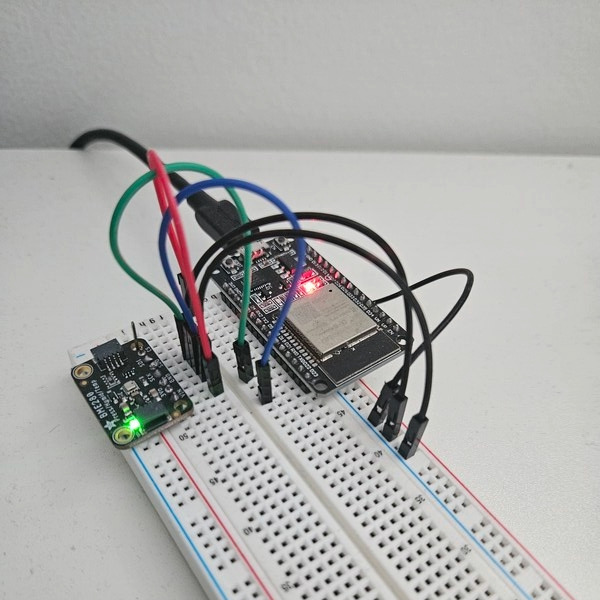

# ESP32 Environment Data Recorder ("Tricorder")

Transmits environment data (pressure, temperature, humidity) over BLE using a BME280 sensor connected to an ESP32 microcontroller via I2C.

### Wiring

In this project, the I2C connection uses GPIO pins 21 (SDA) and 22 (SCL) on the ESP32 development board. Also, the SDO pin on the BME280 is grounded, making the I2C address of the BME280 0x76.

#### Pins

#### Picture

### Setup

1. Install and set up the ESP-IDF extension for VSCode
2. Open this project
3. Open an ESP-IDF terminal (can be found in extension menu)
4. Connect an ESP32 board to a USB port on your computer
5. Run `idf.py -p /dev/ttyUSB0 flash monitor` to build, run, and monitor the project on the board. Replace `/dev/ttyUSB0` with the appropriate port, and if you are on on Windows, replace it with the name of the COM port the ESP32 is connected to.
6. Use any BLE scanning app (e.g. nRF Connect) to read the pressure, temperature, and humidity characteristics from the Environmental Sensing service on the ESP32 (named "ESP32-Tricorder" in scan advertisement).
